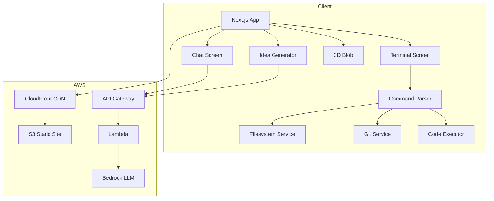
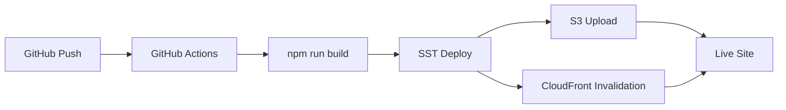
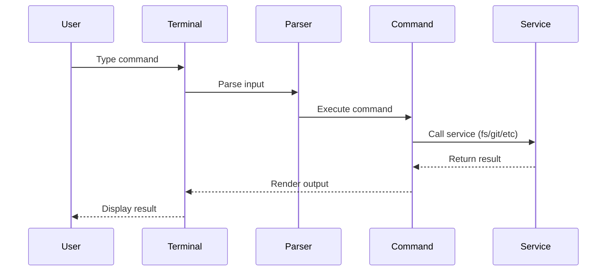

```
 ______                   _             __  __          __         _ __
/_  __/__  ______ _  (_)__  ___ _/ / | |/ /__  / /  _____(_) /____
 / / / _ \/ __/  ' \/ / _ \/ _ `/ /  |   / _ \/ _ \(_-</ / __/ -_)
/_/  \___/_/ /_/_/_/_/_//_/\_,_/_/   |__|\_,_/_.__/___/_/\__/\__/
```

<p align="center">
  
  
  
  
  
</p>

<p align="center">
  <strong>An interactive terminal portfolio with AI-powered tools and 3D experiences</strong>
</p>

<p align="center">
  <a href="https://tomasp.me">Live Demo</a> |
  <a href="#features">Features</a> |
  <a href="#quick-start">Quick Start</a> |
  <a href="#architecture">Architecture</a>
</p>

---

## `$ cat overview.txt`

A terminal-themed portfolio that combines CLI nostalgia with modern web tech. Features an interactive terminal emulator, AI chat with streaming responses, project idea generator, and a 3D retro computer rendered with Three.js.

```
+-------------------------------------------------------------+
|  * o o  tomasp.me                                           |
+-------------------------------------------------------------+
|                                                             |
|  $ whoami                                                   |
|  Tomas Ari Palsson // Software Dev                          |
|                                                             |
|  $ cat skills.txt                                           |
|  AWS - Python - Rust - Flutter - Serverless - LLMs          |
|                                                             |
+-------------------------------------------------------------+
```

---

## `$ ls features/`

| Feature | Description |
|---------|-------------|
| **terminal/** | Full CLI with history, tab completion, reverse search (Ctrl+R) |
| **filesystem/** | Persistent virtual filesystem with localStorage backing |
| **vim/** | Vim-style editor powered by CodeMirror 6 |
| **git/** | Version control with staging, commits, branches, and diffs |
| **shell/** | Environment variables and command aliases |
| **chat/** | Streaming AI chat powered by AWS Bedrock |
| **ideas/** | LLM-powered project brainstorming with favorites |
| **3d/** | Three.js retro terminal with CRT effects |
| **code/** | In-browser JavaScript and Python execution |

### `terminal/` - Interactive CLI

```bash
$ help              # List commands
$ projects          # Browse portfolio
$ cv                # View experience
$ weather london    # Check weather
$ calc 2+2*3        # Math expressions
$ color #ff6b6b     # Change theme
```

### `filesystem/` - Mock Unix Filesystem

```bash
$ pwd                    # Print working directory
$ ls -la                 # List files (including hidden)
$ cd projects            # Change directory
$ mkdir new-project      # Create directory
$ touch README.md        # Create file
$ cat README.md          # View file contents
$ echo "hello" > file    # Write to file
$ cp src dest            # Copy files
$ mv old new             # Move/rename files
$ rm -r folder           # Remove recursively
$ find . -name "*.txt"   # Find files by pattern
$ grep "TODO" .          # Search file contents
```

### `vim/` - Built-in Text Editor

```bash
$ vim file.txt           # Open/create file in editor
```

| Mode | Keys |
|------|------|
| Navigation | `h` `j` `k` `l` / `w` `b` `e` / `0` `$` / `gg` `G` |
| Insert | `i` `a` `o` `O` |
| Visual | `v` |
| Editing | `x` `dd` `yy` `p` `u` |
| Ex Commands | `:w` `:q` `:wq` `:q!` |

### `git/` - Version Control

```bash
$ git init               # Initialize repository
$ git status             # Show working tree status
$ git add file.txt       # Stage changes
$ git commit -m "msg"    # Commit staged changes
$ git log                # View commit history
$ git diff               # Show unstaged changes
$ git branch             # List branches
$ git checkout -b feat   # Create and switch branch
$ git merge feat         # Merge branch
```

### `code/` - In-Browser Execution

```bash
$ node script.js         # Run JavaScript
$ python script.py       # Run Python (via Pyodide)
```

---

## `$ ./quickstart.sh`

```bash
# Clone
git clone https://github.com/TomasPalsson/TerminalWebsite.git
cd TerminalWebsite

# Install
npm install

# Run
npm run dev
```

Opens at `http://localhost:3000`

---

## `$ cat scripts.json`

| Script | Description |
|--------|-------------|
| `npm run dev` | Development server (Next.js) |
| `npm run build` | Production build |
| `npm run start` | Start production server |
| `npm run lint` | Code linting |
| `npm run test` | Run Vitest tests |
| `npm run test:coverage` | Run tests with coverage |
| `npm run deploy` | Deploy to production (SST) |
| `npm run deploy:dev` | Deploy to dev stage |

---

## `$ tree src/`

```
src/
+-- screens/
|   +-- Terminal.tsx        # CLI interface
|   +-- ChatMe.tsx          # AI chat
|   +-- IdeaGenerator.tsx   # Idea tool
|   +-- IdeaLibrary.tsx     # Saved ideas
|   +-- UrlShortener.tsx    # URL shortener
|   +-- AboutMe.tsx         # Bio page
+-- components/
|   +-- commands/           # CLI commands
|   |   +-- fs/             # Filesystem commands
|   |   +-- git/            # Git commands
|   |   +-- vim/            # Vim editor
|   +-- terminal/           # Terminal UI components
|   +-- chat/               # Chat UI and tool renderers
|   +-- TerminalHandler.tsx # Command parser
+-- services/
|   +-- filesystem.ts       # Virtual filesystem
|   +-- git.ts              # Git implementation
|   +-- env.ts              # Environment variables
|   +-- alias.ts            # Command aliases
|   +-- executor/           # JS/Python execution
+-- context/                # React context
+-- hooks/                  # Custom hooks
+-- types/                  # TypeScript definitions
```

```
app/                        # Next.js App Router
+-- page.tsx                # Landing page
+-- terminal/page.tsx       # /terminal
+-- chat/page.tsx           # /chat
+-- idea-generator/page.tsx # /idea-generator
+-- ideas/page.tsx          # /ideas
+-- shorten/page.tsx        # /shorten
+-- blob/page.tsx           # /blob (3D)
+-- aboutme/page.tsx        # /aboutme
+-- layout.tsx              # Root layout
+-- providers.tsx           # Context providers
```

---

## `$ cat stack.json`

```json
{
  "frontend": {
    "framework": "Next.js 16",
    "language": "TypeScript 5",
    "styling": "Tailwind CSS 3.4",
    "state": "React Context"
  },
  "terminal": {
    "editor": "CodeMirror 6",
    "vim": "@replit/codemirror-vim",
    "python": "Pyodide"
  },
  "3d": {
    "engine": "Three.js r177",
    "bindings": "React Three Fiber",
    "helpers": "React Three Drei"
  },
  "infrastructure": {
    "iac": "SST 3.x",
    "hosting": "AWS S3 + CloudFront",
    "ai": "AWS Bedrock"
  }
}
```

---

## `$ cat routes.txt`

| Path | Description |
|------|-------------|
| `/` | Landing page |
| `/terminal` | CLI interface |
| `/chat` | AI chat |
| `/idea-generator` | Idea brainstorming |
| `/ideas` | Saved ideas |
| `/shorten` | URL shortener |
| `/blob` | 3D experience |
| `/aboutme` | About page |

---

## Architecture



### Deployment Flow



### Command Execution



---

## Adding Commands

Commands follow the `Command` interface in `src/components/commands/Command.tsx`:

```typescript
interface Command {
  name: string;
  description: string;
  usage?: React.ReactNode;
  args: string[];
  run: (args: string[], context: KeyPressContextType) => Promise<React.ReactNode | null>;
}
```

Register new commands in `src/components/commands/CommandMap.tsx`.

---

## Environment Variables

| Variable | Description | Required |
|----------|-------------|----------|
| `NEXT_PUBLIC_API_URL` | API Gateway URL | For chat/ideas |

---

## `$ cat links.txt`

- **Site**: [tomasp.me](https://tomasp.me)
- **GitHub**: [TomasPalsson/TerminalWebsite](https://github.com/TomasPalsson/TerminalWebsite)
- **Email**: [tomas@p5.is](mailto:tomas@p5.is)

---

<p align="center">
  <code>// Built by Tomas Ari Palsson</code>
</p>
